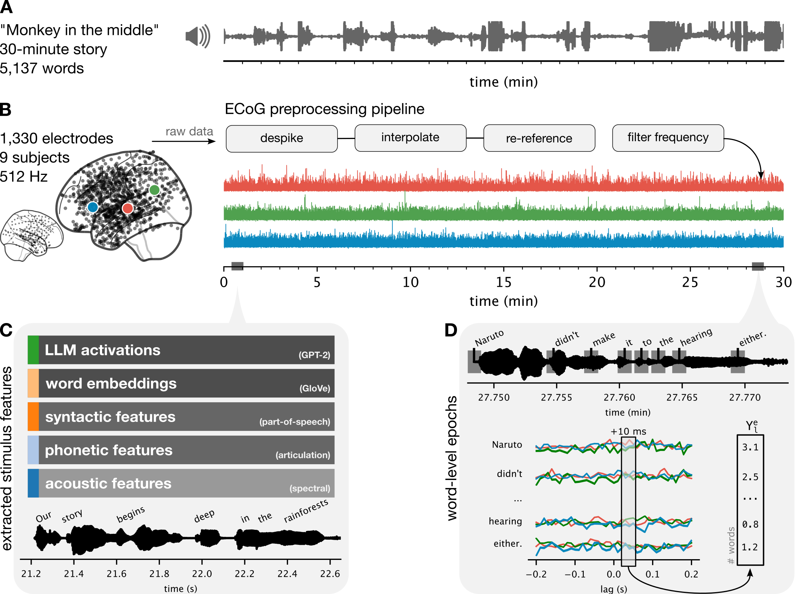

ECoG dataset tutorials
======================

A set of tutorials for working with the "Podcast" ECoG dataset.

Here are three ways to use the tutorials:

1. Carefully read through each tutorial in order.
2. Use the "Open in Colab" link to load a tutorial and run the code yourself to experiment with.
3. `Download <https://openneuro.org/datasets/ds005574/download>`_ the dataset and tutorials locally or to a compute cluster to use the full dataset or with more compute power.

.. toctree::
   :maxdepth: 1
   :caption: Tutorials:

   notebooks/00-intro.ipynb
   notebooks/01-qualitychecks.ipynb
   notebooks/03-features.ipynb
   notebooks/04-encoding.ipynb
   notebooks/06-banded-ridge.ipynb
   notebooks/05-atlases.ipynb
   notebooks/02-preprocessing.ipynb

